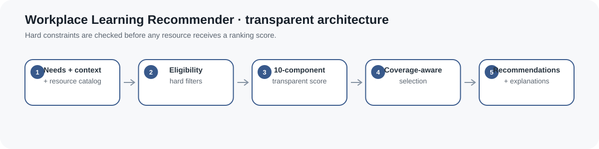
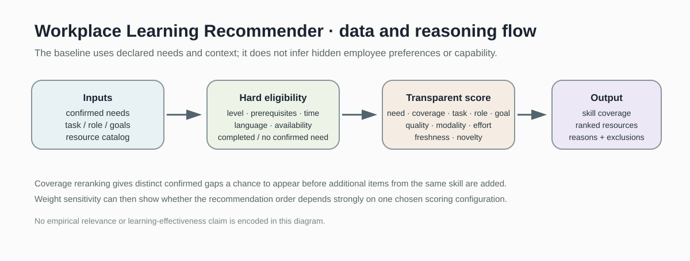
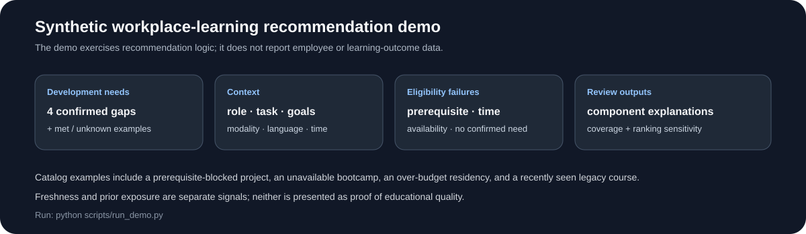

# Workplace Learning Recommender

> Explainable workplace-learning recommendations with hard eligibility checks, context-aware scoring, coverage control, and ranking sensitivity.

[](https://github.com/devissaputra/workplace_learning_recommender/actions/workflows/ci.yml)



**Area:** Learning & Development · Workplace Learning · Recommendation Systems  
**Status:** working research prototype  
**Author:** Devis Wawan Saputra

## Why this project exists

A workplace-learning recommender should not simply return the most popular or highest-rated course.

A useful recommendation has to answer several different questions:

- Is there a confirmed development need?
- Is the resource appropriate for the learner's current level?
- Are prerequisites met?
- Is it actually available?
- Does it fit the current task, role, and learning goal?
- Does it fit the learner's time and modality constraints?
- Has the learner just seen or completed it?
- Is the recommendation list covering several important needs or repeating the same skill?

This repository implements a transparent baseline for those questions.

It does **not** infer employee capability, motivation, personality, career intent, or hidden preferences.

## Core design

The recommender separates **eligibility** from **ranking**.



### Step 1: confirmed development needs

The system expects upstream competency evidence with statuses such as:

- `gap`
- `met`
- `exceeds_target`
- `unknown_evidence`
- `insufficient_evidence`

Only sufficiently supported confirmed gaps enter recommendation ranking.

Missing evidence is not converted into a zero skill level.

The data model is compatible in spirit with the separate `competency_gap_intelligence` project, but this repository has no runtime dependency on it.

### Step 2: explicit workplace context

The request can include:

- role
- role tags
- current task tags
- learning-goal tags
- preferred modalities
- language
- available hours
- completed resources
- recent resource exposures
- an explicit recommendation date

These values are supplied deliberately. The baseline does not infer them from hidden monitoring.

### Step 3: resource catalog

Each resource can declare:

- target skills
- entry level
- target level
- quality
- quality source
- modality
- effort hours
- competency prerequisites
- task tags
- role tags
- goal tags
- language
- availability
- last-updated date

## Hard eligibility filters

A resource is excluded before scoring when it is:

- unavailable
- already completed
- incompatible with the selected language
- longer than the available time budget
- unrelated to any confirmed gap
- above the learner's current entry level
- unable to advance beyond the current level
- blocked by an unmet prerequisite

This avoids a common recommender failure: allowing an unsuitable course to survive because a high quality score compensates for a hard mismatch.

## Transparent ranking

Eligible resources receive ten normalized component scores:

| Component | Meaning |
|---|---|
| Need priority | relative priority of the confirmed competency gap |
| Gap coverage | how much of the remaining level gap the resource can cover |
| Task fit | overlap with the current task tags |
| Role fit | overlap with the role tags |
| Goal fit | overlap with the learning-goal tags |
| Quality | externally supplied resource-quality signal |
| Modality fit | match with declared modality preferences |
| Effort fit | fit within the available learning time |
| Freshness | how recently the resource itself was updated |
| Novelty | how recently the learner saw the same resource |

All component weights are explicit and normalized.

The default weights are a design baseline, not an empirically validated optimum.

## Freshness is not novelty

The original prototype used a `recently_seen` count and called it recency.

That has been replaced by two different signals.

**Freshness** comes from the resource's `last_updated` date.

**Novelty** comes from the learner's supplied days-since-exposure history.

A resource can therefore be new to the learner but old in the catalog, or recently updated but already seen yesterday.

## Coverage-aware selection

A raw ranker can easily return five Python courses because Python happens to have the highest gap.

`select_with_coverage()` first gives different confirmed skill needs an opportunity to appear.

A second pass fills remaining positions while respecting `max_per_skill`.

This is a simple deterministic coverage heuristic, not a learned diversification model.

## Explainability

Every returned recommendation includes:

- matched skill
- total score
- every component score
- gap coverage
- resource metadata
- a plain-language explanation generated from the actual score components

The explanation does not claim contextual fit that was never measured.

## Ranking sensitivity

`ranking_sensitivity()` reruns recommendation with alternative weight configurations.

It reports:

- ranking by scenario
- best and worst rank
- whether the rank stayed stable
- whether the resource appears in every scenario

This makes it easier to see when a recommendation depends heavily on one arbitrary weighting choice.

## Synthetic demo



The bundled synthetic example includes:

- four confirmed development gaps
- one competency above target
- one competency with unknown evidence
- explicit role/task/goal context
- modality and time constraints
- ten learning resources
- an unmet prerequisite
- an unavailable resource
- an over-budget resource
- a stale catalog resource
- recent exposure history
- component-level explanations
- skill-coverage diagnostics
- alternative scoring-weight scenarios

The example is synthetic and is not evidence that any recommendation improves workplace learning.

## Data files

`data/needs.json`  
Synthetic development needs and proficiency scale.

`data/context.json`  
Synthetic workplace-learning context and constraints.

`data/resources.json`  
Structured resource catalog used by the demo.

`data/sample.csv`  
Compact tabular view of the synthetic resource catalog.

`data/README.md`  
Schema, governance, and interpretation guidance.

## Run the project

```bash
git clone https://github.com/devissaputra/workplace_learning_recommender.git
cd workplace_learning_recommender

python scripts/run_demo.py
python -m unittest discover -s tests -v
```

The current baseline uses only the Python standard library.

## Core API

`validate_scale(...)`  
Validates the proficiency scale.

`validate_needs(...)`  
Separates confirmed gaps from met, unknown, or insufficient evidence.

`validate_context(...)`  
Validates explicit role, task, goal, preference, time, language, completion, and exposure context.

`validate_resources(...)`  
Validates structured resource metadata.

`eligibility_report(...)`  
Returns eligible resources and explicit exclusion reasons.

`score_resources(...)`  
Calculates the ten decomposed score components for eligible resources.

`select_with_coverage(...)`  
Limits list concentration and gives distinct skill gaps a chance to appear.

`recommend(...)`  
Returns recommendations, explanations, exclusions, and diagnostics.

`recommendation_diagnostics(...)`  
Reports skill coverage and concentration.

`ranking_sensitivity(...)`  
Tests recommendation order under alternative scoring weights.

## What the current code measures

The current prototype can calculate:

- eligibility
- normalized component scores
- skill coverage
- maximum single-skill share
- exclusion reasons
- ranking sensitivity

It does **not** currently claim empirical:

- nDCG
- precision or recall
- novelty preference
- learner satisfaction
- training effectiveness
- job-performance improvement

Those require relevance labels or real outcome data.

## Evaluation plan


A credible study should examine:

1. **Eligibility precision** — were filtered items truly unsuitable?
2. **Ranking relevance** — do experts and learners prefer the ranked resources?
3. **Coverage and concentration** — are important needs represented without excessive repetition?
4. **Explanation usefulness** — can people understand and challenge the reasons?
5. **Rejection reasons** — why are suggestions postponed, rejected, or corrected?
6. **Learning impact** — do accepted resources improve independent competency evidence?

Clicks and completions alone are not proof of learning.

## Research context

The repository is informed by workplace-learning recommender research on:

- multi-stakeholder learning goals
- task-oriented workplace recommendation
- explainable employee-training recommendation
- learner control and privacy
- adult-learning participation constraints

See `docs/related_work.md` for references and scope boundaries.

## Responsible use

Workplace learning recommendations can become coercive if a system blurs the distinction between learner choice and employer requirements.

This prototype should not be used alone for:

- hiring
- termination
- promotion
- pay
- discipline
- forced ranking
- psychological profiling
- covert monitoring
- automatic career-path assignment

See `docs/ethics_and_risks.md` for the workplace-specific risk review.

## Limitations

The current baseline:

- depends on externally supplied competency needs
- depends on hand-authored resource metadata
- uses simple tag overlap rather than semantic embeddings
- uses heuristic freshness and novelty functions
- uses hand-selected default weights
- does not model resource cost
- does not learn preferences from behavior
- does not model mentoring, peer learning, stretch assignments, job aids, or workflow redesign
- does not estimate causal learning impact
- does not prove that a resource will close a competency gap

A recommendation is a reviewable development suggestion, not an objective prescription.

## Repository map

```text
.
├── .github/workflows/ci.yml
├── assets/
│   ├── architecture.svg
│   ├── data_flow.svg
│   ├── demo_snapshot.svg
│   └── evaluation_dashboard.svg
├── data/
│   ├── README.md
│   ├── context.json
│   ├── needs.json
│   ├── resources.json
│   └── sample.csv
├── docs/
│   ├── ethics_and_risks.md
│   ├── related_work.md
│   └── research_protocol.md
├── reports/model_card.md
├── scripts/run_demo.py
├── src/workplace_learning_recommender/
│   ├── __init__.py
│   └── core.py
├── tests/test_core.py
├── .gitignore
├── CITATION.cff
├── LICENSE
├── pyproject.toml
├── requirements.txt
└── README.md
```

## Research path

A stronger empirical version would:

1. validate the resource catalog with L&D experts
2. collect independent resource-relevance judgments
3. compare with gap-only, quality-only, popularity, and random baselines
4. test explanations with learners and managers
5. collect recommendation rejection and correction reasons
6. evaluate accessibility and language coverage
7. test preference-control designs
8. compare transparent scoring with semantic or learned recommenders
9. measure whether accepted resources improve independent competency evidence
10. examine whether recommendation quality differs systematically across worker contexts

## Citation and license

`CITATION.cff` contains the software citation.

Code and original SVG visuals use the MIT License. External datasets, frameworks, and resource catalogs retain their own licenses and governance requirements.
